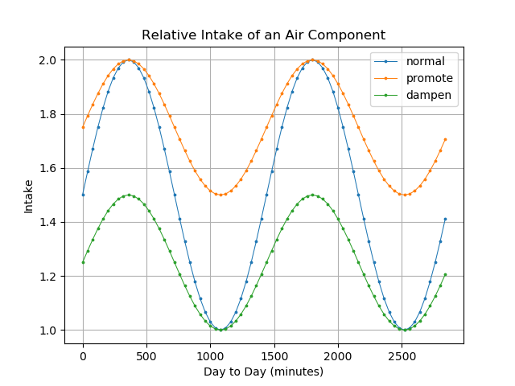

# bedroom air buffer
A "bedroom air buffer" is a personal device that captures air at a particular time in the day and slowly dispenses it throughout the day.

This can be used to alter the air a person intakes.

